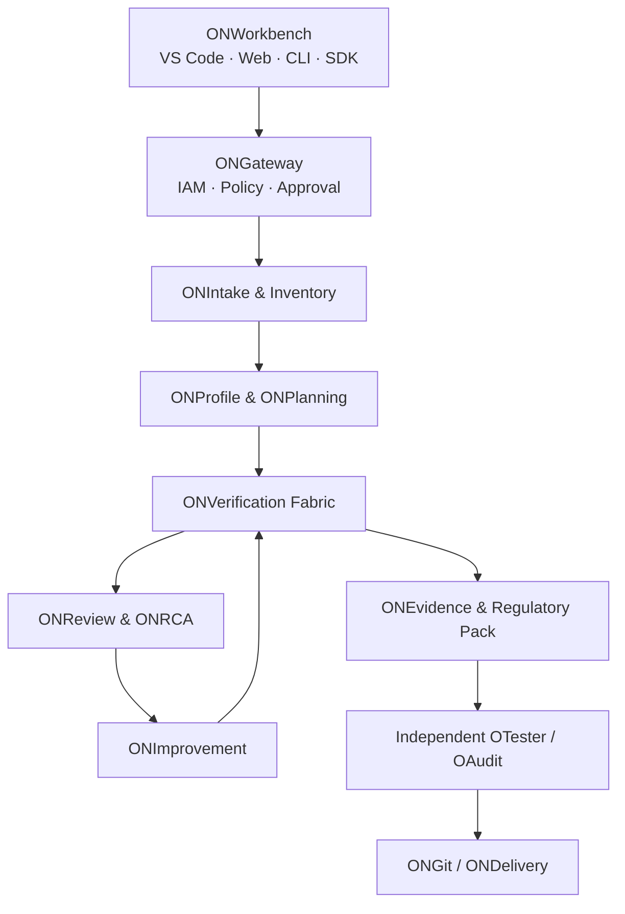

# ONSure 금융권 AI Assurance Platform 최종 목표 설계

- 문서 지위: 최종 제품 상위 정본
- 범위: MVP가 아닌 Goal State
- 판정: 설계 정본이며 구현 완료 증거가 아님

## 1. 제품 미션

ONSure는 금융회사가 자체 개발·구매·위탁·오픈소스로 도입한 AI 제품을 대상으로 요구사항, 설계, 구현, 실제 호출 연결, 데이터·모델·Agent 보안, 품질, 운영 복원력, 금융 통제 적합성을 독립 검증하고, 승인된 개선·재검증·감사 증적까지 제공한다.

## 2. 검증 대상

생성형 AI, RAG, 검색, 챗봇, 전통 ML, 신용평가·심사, FDS, 추천, 문서·보고서 AI, 코드 생성 AI, AI Agent, MCP/Tool 서버, 모델 Gateway, Guardrail, AI 보안제품, 외부 SaaS AI, 내부/폐쇄망 LLM, 제3자 Foundation Model을 포함한다.

접근 수준은 세 가지다.

- White-box: 코드·설계·모델·데이터·운영 증적 접근
- Gray-box: API·설정·제한된 문서·실행로그 접근
- Black-box: 외부 인터페이스와 계약·벤더 증적만 접근

접근 불가 영역은 PASS가 아니라 Coverage Limitation으로 표시한다.

## 3. 입증 상태 모델

| 상태 | 의미 |
|---|---|
| DECLARED | 공급자 또는 문서가 주장 |
| DESIGNED | 통제가 설계에 존재하고 위협과 연결 |
| IMPLEMENTED | 코드·설정·모델에 구현 |
| CONNECTED | 실제 운영 Critical Callpath가 사용 |
| TESTED | 정상·실패·공격·복원 시험 완료 |
| EVIDENCED | 동일 Source/Model/Data/Policy/Environment에 Receipt 결속 |
| INDEPENDENTLY_VERIFIED | 독립 Oracle로 재검증 |
| OPERATING_EFFECTIVELY | 운영 기간 동안 지속 효과 확인 |

낮은 단계를 높은 단계로 추정하지 않는다. 어느 단계든 UNKNOWN이면 상위 단계는 HOLD다.

## 4. 논리 아키텍처



### 4.1 ONIntake
계약·조직·관할·업무 중요도·데이터 등급·접근 수준을 등록한다. Source, Build, Model, Dataset, Prompt, RAG corpus, Vector index, Tool, Policy, Infrastructure, Vendor, Operator를 자산으로 식별한다.

### 4.2 ONLearning
정적 인벤토리, 의존성, 데이터 흐름, 실제 실행 Observation을 결합한다. 프로젝트 전용 기억과 익명화·검증된 범용 지식은 분리한다. 학습 후보는 검증·승인 전 활성 기준이 될 수 없다.

### 4.3 ONProfile
제품 유형·금융업무·Materiality·데이터 민감도·자율행동 권한·외부 연결·배포 형태에 따라 검증 프로파일을 생성한다. 프로파일 변경은 기존 PASS를 자동 승계하지 않는다.

### 4.4 ONPlanning
위협·통제·Coverage Gap을 기준으로 시험계획을 생성한다. 명령, 환경, 데이터, 비용, 시간, 파괴성, 권한, 예상 Oracle을 사전 공개하며 전체/부분 승인을 지원한다.

### 4.5 ONVerification Fabric
다음 시험 엔진을 플러그인 구조로 제공한다.

- Requirements/Design Trace Engine
- SAST/DAST/SCA/Secret/IaC/SBOM/Provenance
- Model and Dataset Scanner
- RAG Authorization/Poisoning/Exfiltration
- Prompt Injection/Jailbreak/Output Safety
- Agent/Tool Capability and Transaction Limits
- Bias/Fairness/Explainability/Reproducibility
- Positive/Negative/Boundary/Adversarial/Metamorphic
- Performance/Load/Soak/Chaos/Backup/Restore/DR
- Runtime Drift/Incident/Revalidation Trigger

### 4.6 ONReview·ONRCA
최초 실패점, 재현 절차, 영향 자산·고객·거래·규정, 원인 후보와 신뢰도를 분리한다. AI 추론과 실행 증거를 구분한다.

### 4.7 ONImprovement
Finding 없는 임의 개선을 금지한다. Plan→승인→격리 Worktree→Patch→동일 Fixture 회귀→Before/After→독립 검증으로 진행한다. 코드·Prompt·Policy·RAG·설정·테스트 변경을 모두 지원한다.

### 4.8 ONEvidence
모든 단계에 Parent Hash를 포함한다. WORM/Object Lock, 신뢰 Timestamp, 외부 Ledger Anchor, Key Registry, Legal Hold, 데이터 등급별 보존, Restricted/Shareable Pack을 제공한다.

### 4.9 ONGit·ONDelivery
Branch/Worktree, Diff, Commit, Push, Draft PR까지 승인 범위에서 수행한다. 서명 Build, Package, Offline Bundle, 배포 전 Gate, Rollback Bundle을 제공한다. Merge·Production/Commercial GO·FinalLock은 사람과 독립검증 Gate가 필요하다.

## 5. 3중+메타 루프

```text
Loop A 정상: 허용된 업무가 올바른 결과·권한·Receipt로 성공
Loop B 실패: 잘못된 입력·장애·누락이 기대 지점/사유로 Fail-Closed
Loop C 공격: 우회·변조·Replay·Injection·Poisoning·권한상승 차단
Loop D 메타: 새 결함을 왜 기존 하네스가 놓쳤는지 분석하고 Registry/Oracle/Gate 보강
```

종료는 반복 횟수가 아니라 신규 원자 Finding 0, 미실행 0, Skip/Disabled 0, 요구-사례-Receipt 추적 100%, 독립 CLEAN 2회로 판정한다.

## 6. 금융권 보안 도메인

1. Governance, Risk Appetite, Model Inventory, Materiality
2. IAM, MFA, RBAC+ABAC, PAM/JIT, SoD, Break-glass
3. Tenant/Project/Customer/Environment Isolation
4. 개인(신용)정보 분류·최소화·마스킹·목적제한·삭제
5. Encryption, KMS/HSM, 키·서명·인증서 수명주기
6. 망분리·제로트러스트·SaaS/외부LLM 통제·폐쇄망
7. Secure SDLC, SBOM, Provenance, Reproducible Build
8. AI/ML/RAG/Agent 전용 위협과 안전성
9. Audit, WORM, Timestamp, Ledger Anchor, Evidence Export
10. HA, Backup/Restore, RTO/RPO, Chaos, DR
11. SOC/SIEM/SOAR, Incident, Forensics, Regulatory Reporting
12. Third-party/Vendor/Cloud/Model Supply-chain Risk
13. Change/Release/Configuration/Exception Management
14. Consumer Protection, Fairness, Explanation, Human Oversight

## 7. 역할과 직무분리

| 역할 | 가능 | 금지 |
|---|---|---|
| Developer | 수정 제안·Worktree 작업·시험 요청 | 자기 변경 Final 승인 |
| AI Product Owner | 범위·업무 Oracle 승인 | 보안 예외 단독 승인 |
| Model Owner | 모델 문서·성능 책임 | 독립 검증자 겸임 |
| Data Owner | 데이터 목적·등급·접근 승인 | 무근거 원문 반출 |
| Security Reviewer | 위협·보안 Finding 검토 | 자신의 통제 구현 최종 승인 |
| Compliance/Legal | 규제 해석·예외·제출 승인 | 기술 실행 결과 위조 |
| Independent Validator | 독립 Oracle 실행 | 제품 개발 코드 직접 승인 |
| Auditor | Evidence 완전성 검토 | Evidence 생성자 겸임 |
| Release Manager | 서명 산출물 전달 | Gate 우회 Merge/배포 |
| CISO/Risk Committee | 위험 수용·Final 의사결정 | UNKNOWN을 PASS로 변경 |

OTester와 OAudit은 서로의 판정 코드를 호출하지 않고 별도 프로세스·별도 Trust Domain으로 실행한다.

## 8. 상태와 판정

`PASS/FAIL/BLOCKED/HOLD/NOT_RUN/INCONCLUSIVE/NOT_APPLICABLE`을 구분한다. N/A는 근거·승인·만료일이 필요하다. 실행 도구 장애는 보안 차단 성공으로 계산하지 않는다. 분모는 Registry에서만 생성한다.

## 9. 배포 토폴로지

- 금융회사 폐쇄망 On-prem
- Private Cloud/VPC
- 중앙 Control Plane + 격리된 Execution Node
- 완전 Air-gapped Offline
- 외부 SaaS 검증용 승인 Egress Gateway

원문·비밀·개인신용정보는 기본적으로 Execution Node 밖으로 나가지 않는다. 모델 Provider 호출은 사전 Data Boundary 평가와 Policy 승인이 필요하다.

## 10. 최종 수용 기준

- 모든 P0 통제 원자화 및 양방향 추적 100%
- 실제 금융 시나리오 3종 이상, 타사 AI 제품 유형 5종 이상
- White/Gray/Black-box 각각 검증
- Positive/Negative/Adversarial/Resilience Registry 분모 일치
- Source/Build/Model/Data/Prompt/Policy/Environment 계보 변조 차단
- IAM·SoD·Tenant·KMS/HSM·WORM·Offline·DR 실제 E2E
- 현재 HEAD 동일 조건 2회 반복
- OTester/OAudit 각 2회 CLEAN
- Critical/High 0, Unknown/Not-run 0
- 사람의 Risk Acceptance와 Final 승인

충족 전 `FinalLock=false, Production GO=false, Commercial GO=false`다.
